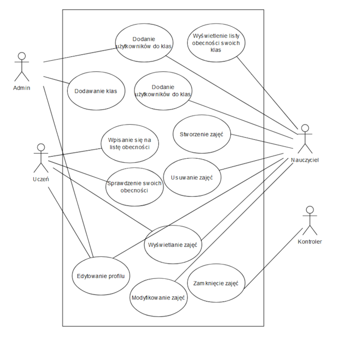

# Lista Obecności - Backend

This is the backend for a digital attendance list web application, built using Spring Boot. The application is designed to handle user authentication, role-based access, and attendance management. The backend is fully integrated with a PostgreSQL database, using Hibernate for ORM. To see the frontend, visit [https://github.com/szczepanskiamikolaj/lista-obecnosci-frontend](https://github.com/szczepanskiamikolaj/lista-obecnosci-frontend).

## Features

- **RESTful API:** The application is designed as a RESTful web service, providing seamless data exchange.
- **Hibernate ORM:** Integrated with a PostgreSQL database using Hibernate for efficient data management.
- **Role-Based Access Control:** The app includes three privilege levels, implemented using Spring Security with JWT tokens:
  - **Admin**
  - **Moderator (Teacher)**
  - **User (Student)**
- **Full Web Operation:** The application can be fully controlled through routes, without direct database interaction. For more information, see the [Use Case Diagram](#use-case-diagram).
- **Swagger Documentation:** Comprehensive API documentation generated using Swagger.

## Environmental Variables

The following environment variables can be configured for the application (default values provided where applicable):

| Variable             | Description                                                            | Default Value                  |
| -------------------- | ---------------------------------------------------------------------- | ------------------------------ |
| `SERVER_PORT`        | The port on which the Spring Boot application will run.                | `8080`                         |
| `DB_HOST`            | The hostname for the PostgreSQL database.                              | `localhost`                    |
| `DB_PORT`            | The port for the PostgreSQL database.                                  | `5432`                         |
| `DB_NAME`            | The name of the PostgreSQL database.                                   | `postgres`                     |
| `DB_USERNAME`        | The username for accessing the PostgreSQL database.                    | `postgres`                     |
| `DB_PASSWORD`        | The password for accessing the PostgreSQL database.                    | `123!@#QWE`                    |
| `ADMIN_PASSWORD`     | The password for the built-in admin user `systemadmin`.                | `TheEscapee3125!!!`            |
| `ADMIN_EMAIL`        | The email address for the built-in admin user `systemadmin`.           | `admin@email.com`              |

## Use Case Diagram



## Getting Started

To get started with the backend, follow these steps:

1. Clone the repository:
   ```bash
   git clone https://github.com/szczepanskiamikolaj/lista-obecnosci-backend.git
   ```
2. Configure the environment variables (either in a .env file or directly in your environment).
3. Build and run the application using Maven:
    ```bash
    mvn spring-boot:run
    ```

For further details, please refer to the API documentation provided by Swagger at [http://localhost:8080/swagger-ui/index.html](http://localhost:8080/swagger-ui/index.html).
